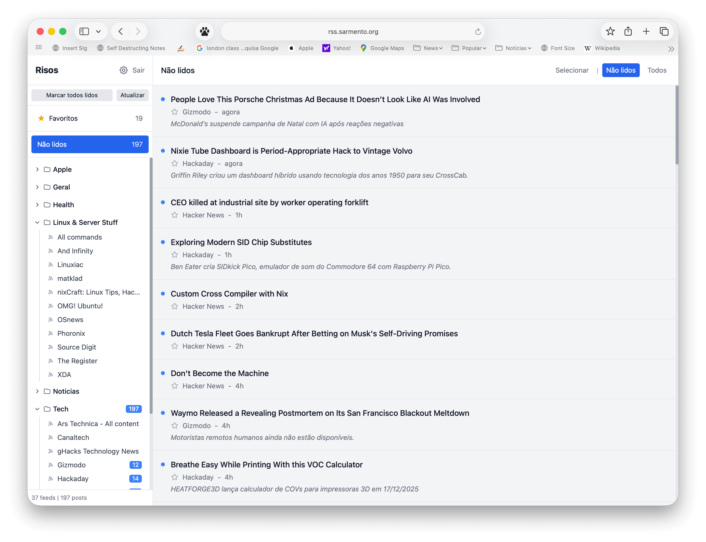
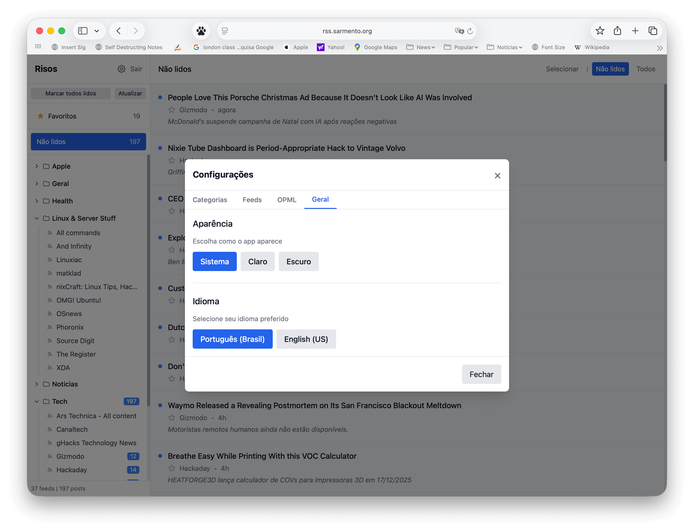
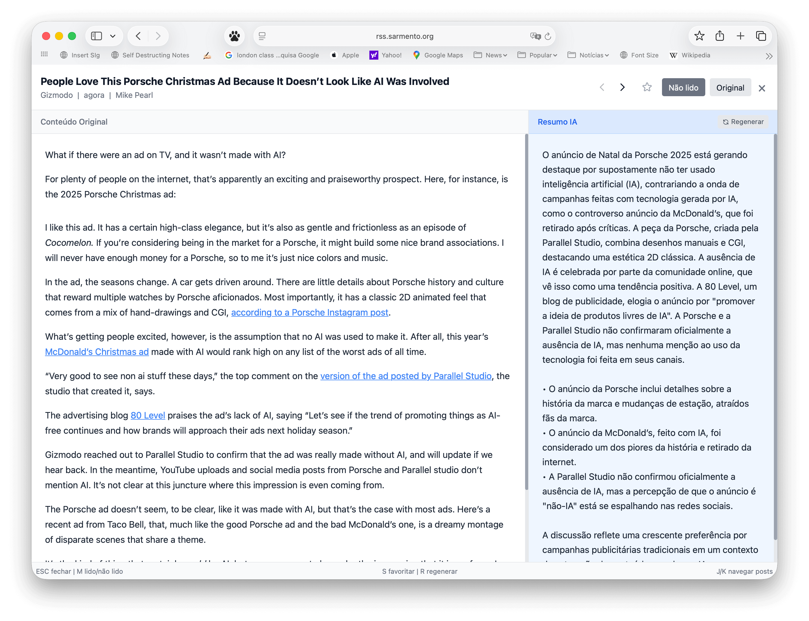

# Risos

A self-hosted RSS reader with AI-powered summaries.

> **Risos** = RSS in Portuguese. Also means "laughs" — because reading news should be enjoyable.

## Features

- **RSS/Atom Feeds** — Subscribe to any feed, or paste a website URL for auto-discovery
- **AI Summaries** — Automatic summarization via Cerebras AI (Llama 3.3 70B)
  - Full article extraction for better context
  - Title translation for foreign-language articles
  - Smart skip of paywalls and error pages
- **Organization** — Categories, starred posts, read/unread tracking
- **Keyboard-first** — Full navigation with J/K/Enter, batch operations with X
- **Dark/Light Theme** — System preference or manual
- **Multi-language UI** — English and Portuguese
- **OPML Import/Export** — Migrate from other readers
- **Mobile Friendly** — Responsive design

## Screenshots





## Quick Start

### Docker

```bash
git clone https://github.com/janiosarmento/risos.git
cd risos
cp backend/.env.example backend/.env
# Edit backend/.env with your settings
docker-compose up -d
# Access at http://localhost:8100
```

### Native (systemd)

```bash
git clone https://github.com/janiosarmento/risos.git /var/www/risos
cd /var/www/risos
sudo ./install.sh
sudo nano backend/.env  # Set APP_PASSWORD, JWT_SECRET, CEREBRAS_API_KEY
sudo systemctl restart risos
```

The installer creates a Python venv, installs dependencies, runs migrations, and sets up a systemd service. On WordOps, nginx is configured automatically.

## Configuration

Edit `backend/.env`:

```bash
# Required
APP_PASSWORD=your_password
JWT_SECRET=your_secret_key_minimum_32_chars  # openssl rand -hex 32
CEREBRAS_API_KEY=your_key                    # from https://cloud.cerebras.ai/

# Optional
SUMMARY_LANGUAGE=English                     # default: Brazilian Portuguese
FEED_UPDATE_INTERVAL_MINUTES=30              # default: 30
```

### Multiple API Keys

For high-volume usage, add multiple Cerebras keys (comma-separated):

```bash
CEREBRAS_API_KEY=key1,key2,key3
```

Keys rotate automatically. Rate-limited keys (429) enter a 60-second cooldown.

## Web Server

The app has two parts:
- **Frontend**: Static files in `htdocs/` (served by nginx)
- **Backend**: Python API on port 8100 (proxied via `/api`)

### Nginx

```nginx
server {
    listen 80;
    server_name your-domain.com;
    root /path/to/risos/htdocs;

    location / {
        try_files $uri $uri/ /index.html;
    }

    location /api/ {
        proxy_pass http://127.0.0.1:8100;
        proxy_set_header Host $host;
        proxy_set_header X-Real-IP $remote_addr;
        proxy_set_header X-Forwarded-For $proxy_add_x_forwarded_for;
        proxy_set_header X-Forwarded-Proto $scheme;
    }

    location /static/ {
        expires 30d;
    }
}
```

### Apache

```apache
<VirtualHost *:80>
    ServerName your-domain.com
    DocumentRoot /path/to/risos/htdocs

    <Directory /path/to/risos/htdocs>
        FallbackResource /index.html
    </Directory>

    ProxyPass /api http://127.0.0.1:8100/api
    ProxyPassReverse /api http://127.0.0.1:8100/api
</VirtualHost>
```

Enable modules: `a2enmod proxy proxy_http`

### Multiple Instances

The app is single-user (no accounts, just a password). For multiple users on one server, run separate instances:

```bash
# Instance 1: port 8100, service "risos"
cd /var/www/user1.example.com && sudo ./install.sh

# Instance 2: port 8101, service "risos-user2"
cd /var/www/user2.example.com && sudo ./install.sh
```

Each has its own database, config, and service.

## Keyboard Shortcuts

| Key | Action |
|-----|--------|
| `J` / `K` | Navigate posts |
| `Enter` | Open post |
| `M` | Toggle read/unread |
| `A` | Mark all as read |
| `S` | Toggle star |
| `X` | Toggle select mode |
| `Space` | Toggle checkbox (in select mode) |
| `R` | Refresh feeds / Regenerate summary |
| `Escape` | Close modal |

Shortcuts are shown on buttons in desktop view.

## Customization

### AI Prompts

```bash
cp backend/prompts.yaml.example backend/prompts.yaml
nano backend/prompts.yaml
```

Changes apply immediately (no restart). The file is gitignored.

### Translations

Edit `htdocs/static/locales/en-US.json` or `pt-BR.json`.

## Tech Stack

- **Backend**: Python, FastAPI, SQLite, APScheduler
- **Frontend**: Alpine.js, Tailwind CSS (CDN)
- **AI**: Cerebras API

## Development

```bash
cd backend
python -m venv venv && source venv/bin/activate
pip install -r requirements.txt
uvicorn app.main:app --reload --port 8100
```

Frontend needs no build — just edit files in `htdocs/`.

---

## About This Project: 100% Vibe Coded

This entire project was developed through **Vibe Coding** using [Claude Code](https://claude.ai/claude-code) — not a single line of code was written or edited manually. Every file, every function, every CSS rule was generated through AI-assisted development.

This is both a testament to how far AI coding tools have come, and a reminder of what it actually takes to use them effectively.

### The Tools Are Impressive, But...

Modern LLMs can write excellent code. They understand patterns, follow best practices, and can implement complex features in seconds. But here's what this project taught us:

**AI doesn't replace expertise — it amplifies it.**

The quality of AI-generated code is directly proportional to the quality of the guidance it receives. Knowing *what* to ask for, *how* to structure a system, *when* to push back on a suggestion, and *which* patterns to follow — these still require deep technical knowledge.

Without understanding software architecture, you can't evaluate if the AI's suggestion is sound. Without knowing security principles, you won't catch vulnerabilities. Without experience debugging production systems, you won't ask the right questions when things break.

### What Vibe Coding Actually Requires

- **Clear architectural vision** — The AI can build what you describe, but you need to know what to describe
- **Pattern recognition** — Spotting when generated code is heading in the wrong direction
- **Technical vocabulary** — Communicating precisely what you need
- **Quality judgment** — Knowing good code from bad, even if you didn't write it
- **Debugging skills** — When it doesn't work, you still need to understand why

### The Bottom Line

AI coding assistants are extraordinary tools that can 10x productivity for experienced developers. But they're not magic wands that let anyone build production software.

The future isn't "AI replaces programmers" — it's "programmers who master AI tools outperform those who don't."

This project exists because of excellent AI tools *and* years of accumulated knowledge about how software should be built.

---

## License

MIT License — see LICENSE file.

## Contributing

Pull requests welcome.
